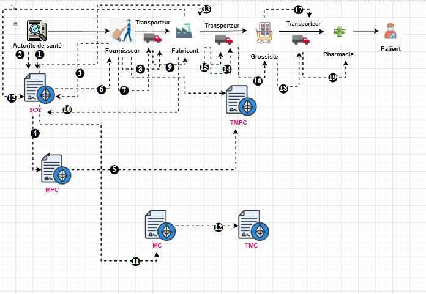

# Supply-Chain :pill:

Supply Chain Pharmaceutique basée Blockchain :
Traçabilité et Réduction de la Contrefaçon des
Médicaments

## ✨ Motivation

Dans notre étude, nous avons choisi de nous concentrer sur la traçabilité des médicaments
au sein de la supply chain pharmaceutique. Plusieurs systèmes de traçabilité existent pour
lutter contre les médicaments contrefaits, tels que les codes QR, les codes-barres et les
puces RFID. Cependant, l’utilisation de la technologie de la blockchain présente plusieurs
avantages par rapport à ces options. Tout d’abord, contrairement aux codes QR et aux
49
codes-barres, la blockchain offre un stockage décentralisé et inviolable des informations.
Cela garantit la sécurité des données relatives aux médicaments, rendant plus difficile la
falsification ou la contrefaçon des informations. De plus, un système de traçabilité basé
sur la blockchain permet une traçabilité complète de la supply chain des médicaments, de
la production à la distribution. Cette approche facilite l’identification rapide des produits
contrefaits, ce qui permet leur retrait du marché et contribue ainsi à la protection de la
santé des patients. Par ailleurs, un système de traçabilité basé sur la blockchain favorise
la transparence et la responsabilité. Les informations enregistrées sur la blockchain sont
accessibles à toutes les parties prenantes de la supply chain, renforçant ainsi la confiance
dans le système de santé et garantissant une meilleure qualité et authenticité des médicaments.
Enfin, un système de traçabilité basé sur la blockchain offre une efficacité accrue pour
les organismes de réglementation. Il leur permet de surveiller plus efficacement la chaîne
d’approvisionnement des médicaments et de s’assurer que les normes de qualité et de
sécurité sont respectées.En résumé, l’utilisation de la technologie de la blockchain pour
la traçabilité des médicaments présente des avantages significatifs en termes de sécurité,
de traçabilité, de transparence et d’efficacité pour lutter contre le trafic de médicaments
contrefaits et garantir la qualité des produits pharmaceutiques. 

## ⚡ Our Solution

La blockchain peut jouer un rôle clé en permettant de suivre les mouvements des médicaments tout au long de la supply chain pharmaceutique, contribuant ainsi à lutter contre le
trafic de faux médicaments. Pour cela, nous avons proposé un système de traçabilité basé
sur la blockchain. Ce système est principalement composé de trois niveaux essentiels :
▶ Le premier niveau comprend tous les acteurs du système, tels que l’autorité de santé,
le fournisseur, le fabricant, le grossiste, le transporteur, la pharmacie, les contrôleurs
de qualité(CQ) et les contrôleurs de marchandise(CM).
▶ Le deuxième niveau comprend les smart contracts intégrés dans cette proposition.
Ils jouent un rôle essentiel pour faciliter l’accès à la blockchain en permettant l’enregistrement des données relatives aux acteurs de la supply chain pharmaceutique,
ainsi que des informations détaillées sur les matières premières et les médicaments.
L’objectif principal de cette approche est d’assurer une traçabilité complète des médicaments, depuis leur stade de matière première jusqu’à leur état final de médicament
prêt à être livré. Les smart contracts permettent de suivre et de vérifier chaque étape
du processus de fabrication et de livraison des matières premières et des médicaments.
50
▶ Le troisième niveau comprend trois couches principales. Tout d’abord, la couche
Interface est responsable de l’affichage des informations à l’utilisateur, de la collecte
des entrées utilisateur et de la gestion des interactions entre l’utilisateur et le système.
Ensuite, il y a la couche API qui permet d’accéder aux fonctionnalités du système
et d’interagir avec lui. Cette couche agit comme un intermédiaire entre la couche
Interface et la couche de données. Enfin, il y a la couche de données, qui gère la
sauvegarde et la récupération des données 

## 💻 System Overview

